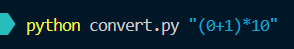
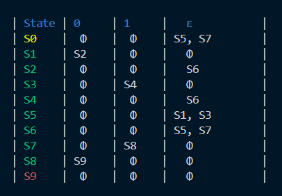
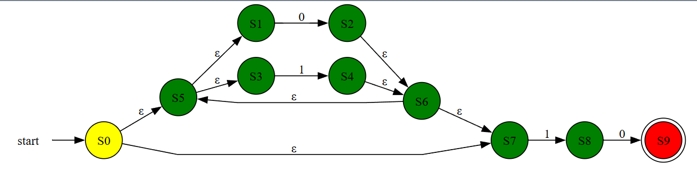

# Regular Expression to Epsilon NFA

A python tool for Regex conversion to nondeterministic finite automaton (NFA).


<hr>

## Language Used: 
<div align="center">

</div>

<hr>


## About:
This repo contains the 🐍 code for converting a valid Regular Expression to its equivalent Epsilon-NFA.
 
The code is divided into these major parts:

1. NFA CONSTRUCTION
2. NFA TRANSITION TABLE
3. NFA VISUALIZATION

<hr>

## How to use:

Make sure you have <a href="https://graphviz.org/download/"> Graphviz </a> installed in your system and added to System PATH. 

and for necessary Python Libraries, simply run:
```bash
pip install -r requirements.txt
```

Now open terminal(in the same folder) and run:

```bash
python convert.py "REGEX"
```

replace the <i>REGEX</i> with the actual Regular Expression you want to generate the table and graph for.

<b>NOTE: No guarantee that the code works for all types of regular expressions, but works for most of them.</b>
<hr>

## example usage:
<div align="center">
    
    <br><br> 
    
    <br><br>
    
</div>

<hr>

<u>Any suggestions, improvements, and feedback is welcome.</u>
